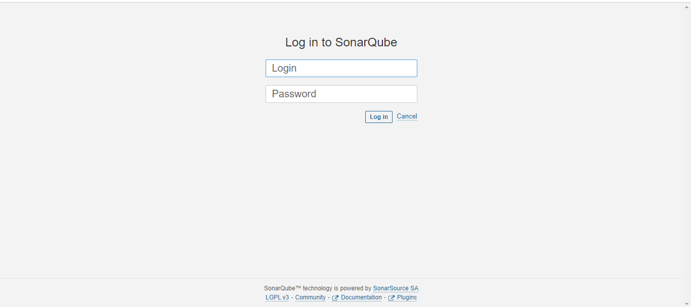

# Gitlab CI/CD Pipeline for YouTube clone application 

This documentation provides a detailed guide to set up a GitLab CI/CD pipeline for provisioning a YouTube page. It includes steps for npm dependencies, SonarQube analysis, Trivy file scan, Docker image build and push, image scan, application deployment, and Azure VM setup for GitLab Runners.

## Prerequisites

Before setting up the CI/CD pipeline, ensure you have the following in place:

1. **Azure Account:** Create an Azure account to provision a Virtual Machine (VM).

2. **GitLab Account:** Create a GitLab account and a repository for your project.

3. **Docker Hub Account:** Set up an account on Docker Hub for image storage.

## Step 1: Azure Virtual Machine Setup

### Provisioning Azure VM (Before Project Setup)

- Log in to the Azure Portal.
- Create a new Virtual Machine (VM) with Linux OS (e.g., Ubuntu).
- Configure security settings, SSH keys, and open ports as needed.
- Note the public IP address and SSH into the VM.

## GitLab CI/CD Variables
Project-Level Variables
Navigate to Project Settings:
Go to your GitLab project.
Click on "Settings" > "CI / CD" > "Variables."
Add Project-Level Variables:
Add project-level variables such as DOCKER_USERNAME and DOCKER_PASSWORD to securely authenticate with Docker Hub during the Docker image push stage

 

### Install GitLab Runner on Azure VM

- Follow the [official GitLab Runner installation instructions](https://docs.gitlab.com/runner/install/linux-repository.html) for your Linux distribution.
 

 


## Step 2: Install Dependencies

### npm Dependencies (Stage: npm)

Install project dependencies using Node.js:

```yaml
stages:
  - npm

Install-dependency:
  stage: npm    
  image:
    name: node:16
  script:
    - npm install
```
 

## Step 3: SonarQube Analysis

### SonarQube Check (Stage: sonar)

Perform SonarQube analysis to ensure code quality:

```yaml
sonarqube-check:
  stage: sonar
  image: 
    name: sonarsource/sonar-scanner-cli:latest
    entrypoint: [""]
  variables:
    SONAR_USER_HOME: "${CI_PROJECT_DIR}/.sonar"
    GIT_DEPTH: "0"
  cache:
    key: "${CI_JOB_NAME}"
    paths:
      - .sonar/cache
  script: 
    - sonar-scanner
  allow_failure: true
  only:
    - main
```
 

 

## Step 4: Trivy File Scan

### Trivy File Scan (Stage: trivy file scan)

Perform a file-level security scan using Trivy:

```yaml
Trivy-file-scan:
  stage: trivy file scan
  image:
    name: aquasec/trivy:latest
    entrypoint: [""]
  script:
    - trivy fs .
```
 

 


## Step 5: Docker Image Build and Push

### Docker Build and Push (Stage: docker)

Build the Docker image and push it to the registry:

```yaml
docker-build-push:
  stage: docker
  image:
    name: docker:latest
  services:
    - docker:dind   
  script:
    - docker build --build-arg REACT_APP_RAPID_API_KEY=<API KEY> -t youtubeclone .  
    - docker tag youtubeclone olaoyefaith/youtubeclone:latest
    - docker login -u $DOCKER_USERNAME -p $DOCKER_PASSWORD
    - docker push olaoyefaith/youtubeclone:latest

```


## Step 6: Trivy Image Scan

### Trivy Image Scan (Stage: trivy image scan)

Perform an image-level security scan using Trivy:

```yaml
Trivy-image-scan:
  stage: trivy image scan
  image:
    name: aquasec/trivy:latest
    entrypoint: [""]
  script:
    - trivy image olaoyefaith/youtubeclone:latest
```


## Step 7: Application Deployment

### Deploy Application (Stage: run container)

```yaml
deploy:
  stage: run container
  tags:
    - youtube
  script:
    -  docker run -d --name youtube -p 3000:3000 olaoyefaith/youtubeclone:latest

```


